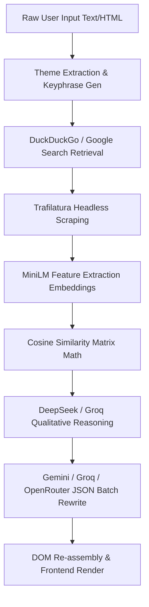

<div align="center">
  
  <h1>Content Refactoring Engine (CRE SaaS)</h1>
  <p><strong>An Enterprise-Grade AI Semantic Validation & Refactoring Pipeline</strong></p>
  
  <p>
    <a href="https://render.com"></a>
    <a href="https://fastapi.tiangolo.com/"></a>
    <a href="https://www.sqlite.org/index.html"></a>
  </p>
</div>

---

## 🚀 Overview

The **Content Refactoring Engine (CRE)** is an advanced SaaS application designed to combat plagiarism and ensure the originality and AdSense-safety of written content. It doesn't just spin text; it mathematically analyzes the semantic uniqueness of an article against millions of live web pages and autonomously refactors it using a triple-redundant LLM fallback chain.

### ✨ Key Features

- **🔴 Copyleaks-Style Dynamic UI**: Real-time SSE (Server-Sent Events) streaming progress panel with skeleton shimmer loading.
- **🛡️ AdSense Risk Analysis**: AI actively grades content against Google's Helpful Content Update and AdSense polices to ensure monetization safety.
- **🔄 Triple-Redundancy LLM Chain**: Never experience downtime. Automatically fails over from **DeepSeek ➔ Groq ➔ OpenRouter** in milliseconds.
- **🧬 Semantic Similarity Math**: Uses HuggingFace `all-MiniLM` embeddings and exact O(N x M) Cosine Similarity matrices—not just keyword matching.
- **📦 Zero-DOM-Corruption Rewrites**: Converts complex HTML into isolated JSON block structures before AI processing, mathematically guaranteeing zero structural loss during rewrites.
- **📚 User History Tracking**: Persistent SQLite storage allowing users to review all past scans and similarity scores.

---

## 🧠 The Architecture Pipeline

When an article is submitted, it travels through this exact pipeline:



## 🛠️ Technology Stack

| Component | Technology |
|---|---|
| **Frontend** | Vanilla JS, HTML5, Modular CSS, Server-Sent Events (SSE) |
| **Backend** | Python 3.10, FastAPI, Uvicorn, Gunicorn (Production) |
| **Logic Layers** | BeautifulSoup4, lxml, numpy, scikit-learn, sentence-transformers |
| **Web Crawlers** | duckduckgo-search, googlesearch-python, Trafilatura |
| **AI Inference** | DeepSeek API, Groq Cloud API, OpenRouter API, Google Gemini API |
| **Database** | SQLite3 (Usage Tracking, API Key Auth, History Logs) |

---

## ☁️ 1-Click Render Deployment

This application is fully containerized and modeled via Infrastructure as Code (`render.yaml`) for instant deployment on [Render](https://render.com).

### Deployment Steps:
1. **Fork or Push** this repository to your GitHub account.
2. Sign in to **Render Dashboard** and click `New +` ➔ `Blueprint`.
3. Select your repository.
4. Render will automatically read the `render.yaml` file, run `./build.sh` to install requirements, and boot up with `./start.sh` using 4 Gunicorn production workers.
5. Under your service's `Environment` tab on Render, add the necessary API Keys.

### Required Environment Variables

```env
GEMINI_API_KEY=your_key_here
DEEPSEEK_API_KEY=your_key_here
GROQ_API_KEY=your_key_here
OPENROUTER_API_KEY=your_key_here
```

*(Note: The system gracefully handles missing API keys by instantly falling back to the next available provider in the chain).*

---

## 💻 Local Development

1. **Clone the repo**
   ```bash
   git clone https://github.com/yourusername/content-refactor-engine.git
   cd content-refactor-engine
   ```

2. **Create a Virtual Environment**
   ```bash
   python -m venv venv
   source venv/bin/activate  # On Windows: venv\Scripts\activate
   ```

3. **Install Dependencies**
   ```bash
   cd backend
   pip install -r requirements.txt
   ```

4. **Boot the Server**
   ```bash
   uvicorn main:app --reload
   ```
   
5. **Access the Application**
   Open your browser and navigate to `http://localhost:8000`.

---
<div align="center">
  <i>Built with precision for flawless content generation.</i>
</div>
